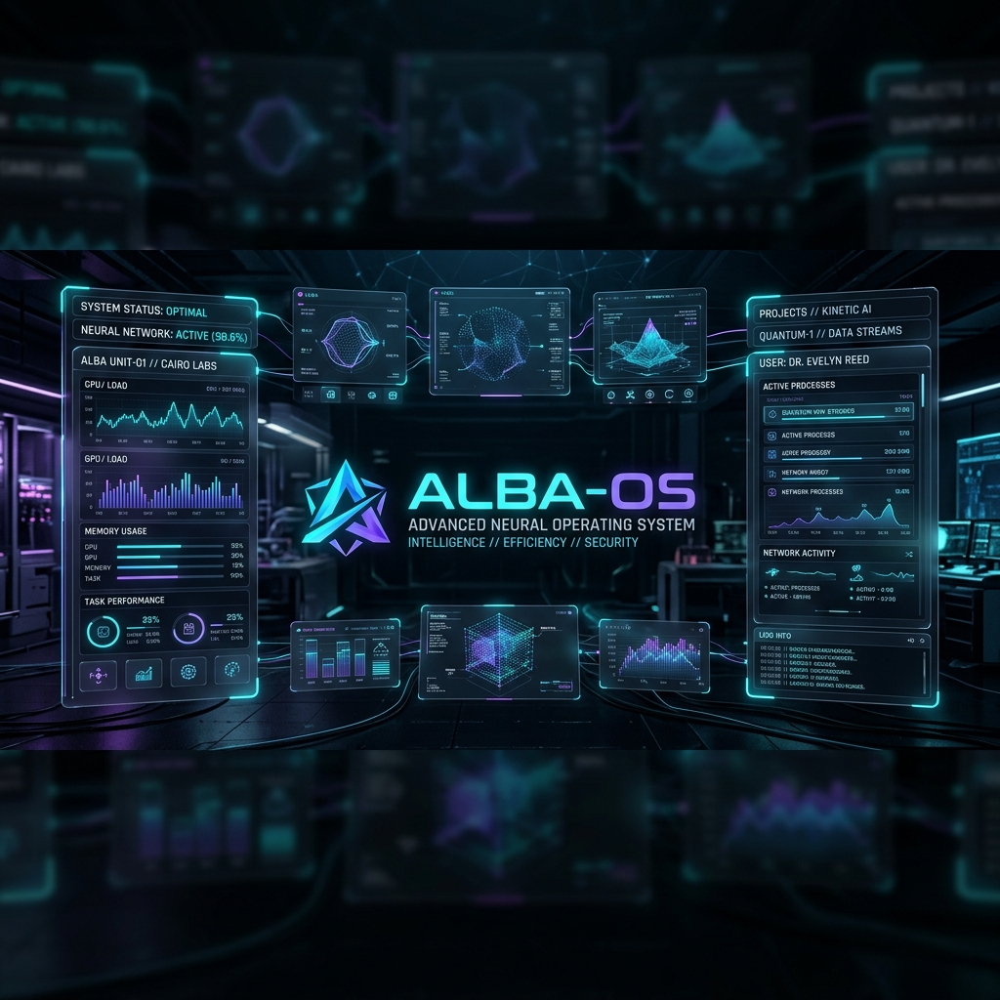
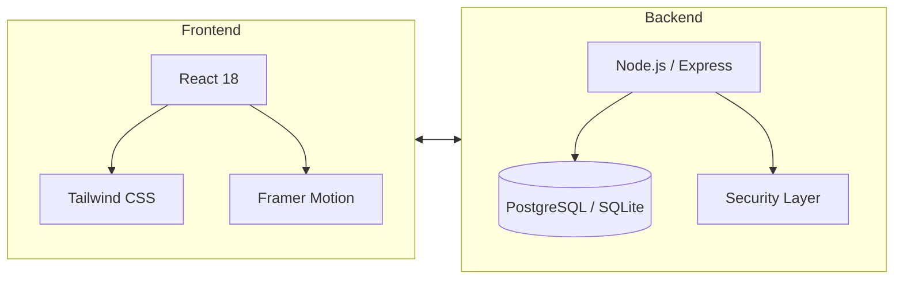

<div align="center">



# 🦅 ALBA-OS v2.0: ELITE_SOFTWARE_COMMAND_CENTER 🦅

[](https://github.com/albagar2/Portfolio)
[](https://github.com/albagar2/Portfolio)
[](https://github.com/albagar2/Portfolio)

**ALBA-OS** no es un porfolio convencional; es un **Ecosistema Digital de Alta Ingeniería** diseñado para proyectar una identidad profesional disruptiva e innovadora.

[🚀 Despliegue Rápido](#-operación_prod) • [📂 Módulos del Sistema](#-estructura-de-módulos_sys) • [🏛️ Arquitectura](#-arquitectura-técnica) • [🔬 Protocolos](#-protocolos-de-ingeniería-desplegados)

</div>

---

### 🔬 PROTOCOLOS DE INGENIERÍA DESPLEGADOS

> [!NOTE]
> Todos los sistemas están optimizados para una experiencia inmersiva y de alto rendimiento.

#### 🌍 01. CONECTIVIDAD GLOBAL (MULTI-LENGUAJE)
Integración de un **Protocolo de Traducción Dinámica** nativo. Conmutación instantánea entre español e inglés sincronizando telemetría y mensajes de sistema sin refresco de página.

#### 🤖 02. BLINDAJE IA (ATS/SEO OPTIMIZED)
Arquitectura diseñada para superar filtros de Inteligencia Artificial (ATS):
- **JSON-LD Structured Data**: Inyección de metadatos de esquema para indexación proactiva.
- **Semántica Pura (HTML5)**: Jerarquías atómicas para legibilidad algorítmica.
- **Data Layer Invisible**: Palabras clave críticas priorizadas para bots de reclutamiento.

#### 🎯 03. INTERFAZ OPERATIVA TÁCTICA
- **HUD Cursor (Laser Aim)**: Diagnóstico de coordenadas X/Y en tiempo real.
- **Glassmorphism 4.0**: Paneles translúcidos con bordes de luz reactivos.
- **Scan-Line Engine**: Efectos de barrido láser para una inmersión "Cyber-OS" total.

---

### 🏛️ ARQUITECTURA TÉCNICA



- **Runtime**: Node.js v20+
- **Styling**: TailwindCSS con custom design system.
- **State**: Context API con persistencia local.

---

### 📂 ESTRUCTURA DE MÓDULOS_SYS

| Módulo | Función | Tecnología |
| :--- | :--- | :--- |
| `Core Engine` | Gestión de rutas y traducciones | React / TSS |
| `Visual DNA` | Estilos, animaciones y efectos | CSS-Next / Framer |
| `Data Link` | API de servicios y proyectos | Express / Prisma |
| `Security` | Protocolos de validación y acceso | JWT / Argon2 |

---

### 🏁 OPERACIÓN_PROD

Para inicializar el núcleo del sistema en un entorno local:

1. **Cargar Dependencias:**
   ```bash
   npm install
   ```
2. **Arrancar Motor Local:**
   ```bash
   npm run dev
   ```
3. **Estado del Sistema:**
   > `ALBA_HOST:5173 // INICIALIZACIÓN COMPLETA // OPERATIVO`

---

<div align="center">

© 2026 **ALBA GARCÍA LÓPEZ** | INGENIERÍA DE SOFTWARE & DISEÑO TÁCTICO
*Todos los derechos reservados.*

</div>

